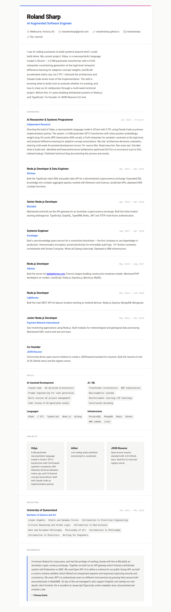

# jsonresume-theme-claude

A [JSON Resume](https://jsonresume.org) theme designed and built entirely by Claude Code in the terminal. No Figma, no browser preview — just an AI coding assistant iterating on HTML/CSS through screenshots.



## Features

- Clean, modern typography with system font stack
- Dark mode support via `prefers-color-scheme`
- Print-optimized `@media print` styles for PDF export
- Markdown rendering in summary and description fields
- Responsive layout
- Inline SVG icons
- Gradient accent bar header

## Usage

### With the JSON Resume registry

Add to your `resume.json`:

```json
{
  "meta": {
    "theme": "claude"
  }
}
```

Your resume will render at `https://registry.jsonresume.org/yourusername`

### With resumed (recommended CLI)

```bash
npm install resumed jsonresume-theme-claude
npx resumed render resume.json --theme jsonresume-theme-claude
```

### With resume-cli

```bash
npm install resume-cli jsonresume-theme-claude
resume export resume.html --theme claude
```

### Programmatic

```javascript
import { render } from 'jsonresume-theme-claude';
import { readFile } from 'fs/promises';

const resume = JSON.parse(await readFile('resume.json', 'utf-8'));
const html = render(resume);
```

## How this was made

This theme was created as an experiment in AI-assisted design. The entire process — from scaffolding to CSS to visual iteration — was done by Claude Code running in a terminal. Playwright was used to take screenshots so Claude could visually review and refine its own output without ever opening a browser.

Read the full blog post: [TODO: link]

## License

MIT
